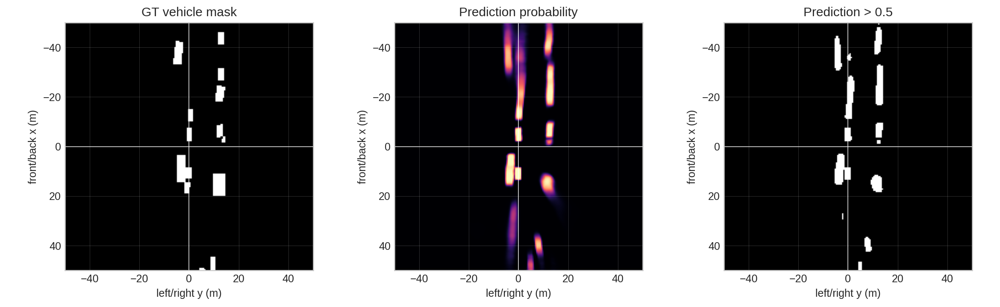
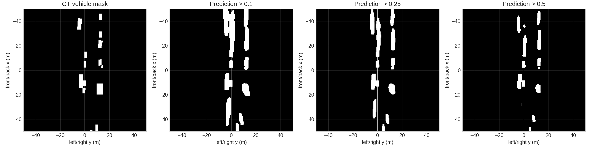
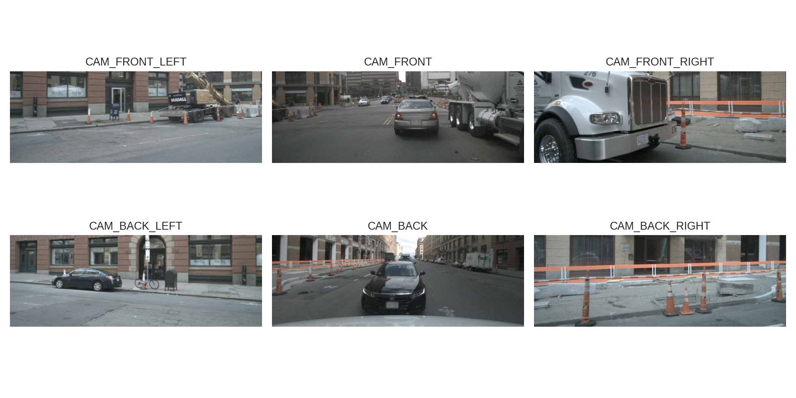
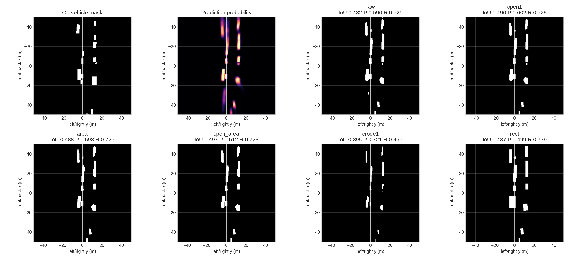
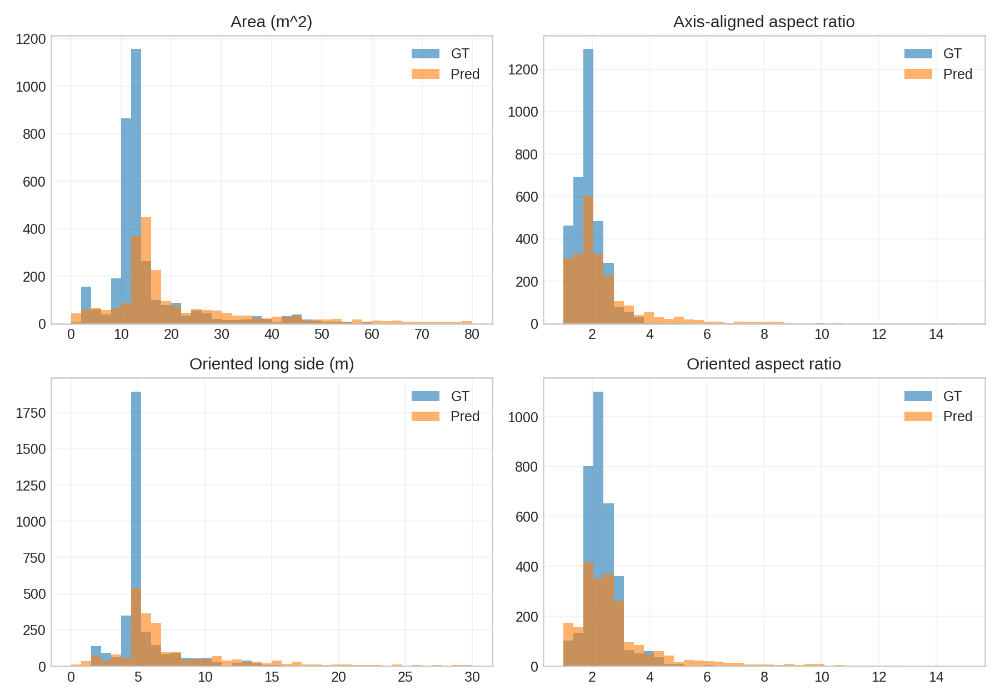

# Lift-Splat-Shoot 论文复现报告

## 1. 复现目标

本项目复现论文 **Lift, Splat, Shoot: Encoding Images From Arbitrary Camera Rigs by Implicitly Unprojecting to 3D** 中的多相机 BEV 感知流程。官方代码仓库为 [nv-tlabs/lift-splat-shoot](https://github.com/nv-tlabs/lift-splat-shoot)，论文地址为 [arXiv:2008.05711](https://arxiv.org/abs/2008.05711)。

本次复现的主要目标不是追求 leaderboard 级别性能，而是从科研训练的角度完整跑通一条 depth-based BEV perception pipeline，并理解其工程结构、数据流、几何投影和实验调参过程。具体目标包括：

- 在 nuScenes 数据集上跑通官方 LSS pipeline。
- 理解从多相机图像到 BEV vehicle segmentation 的模型流程。
- 完成官方 checkpoint 对齐检查。
- 基于 full nuScenes trainval 进行自训练。
- 对输入分辨率、depth bins、数据增强和学习率策略进行 ablation。
- 生成 BEV 预测可视化，并分析主要误差来源。
- 进一步尝试 Dice loss、形态学后处理和车辆形状约束，判断简单工程改进是否还能继续带来收益。
- 梳理后续可衔接 BEVFormer 和生成式深度估计模型的研究方向。

## 2. 方法概述

LSS 的核心思想是将多相机图像特征隐式提升到 3D 空间，再聚合到 BEV 网格中。整体流程可以概括为：

```text
multi-camera images
    -> image backbone
    -> image features + depth distribution
    -> lift to camera frustum
    -> transform to ego frame using camera geometry
    -> voxel pooling / splat to BEV grid
    -> BEV encoder
    -> vehicle occupancy segmentation
```

### 2.1 Image Backbone

模型首先对每个相机图像分别提取 2D 特征。官方实现中使用 EfficientNet-B0 作为图像 backbone。输入是多相机图像张量：

```text
images: (B, N_cam, 3, H, W)
```

每个相机图像经过 backbone 后得到下采样后的 image feature map。

### 2.2 Depth Distribution

LSS 不直接预测单一深度值，而是将深度离散为多个 depth bins，并为每个像素预测一个离散 depth distribution。这样每个 2D 像素特征可以沿多个可能深度展开到 3D frustum 中。

本次实验中主要使用：

```text
dbound = [4, 45, 1]
```

即从 4m 到 45m，每 1m 一个 depth bin。

### 2.3 Lift

Lift 操作将 2D image feature 沿 depth bins 展开。直观上，每个像素位置不再只是一个 2D 特征，而是在多个深度假设下形成一条 frustum ray。depth probability 决定该像素特征在不同深度位置的权重。

### 2.4 Geometry Projection

`get_geometry` 利用相机内参、外参以及图像增强产生的 `post_rots` / `post_trans`，将 frustum 中的点从图像坐标映射到 ego 坐标系。这个步骤是 LSS 的关键，因为模型需要把来自不同相机的特征放到同一个 BEV 坐标系中。

### 2.5 Splat / Voxel Pooling

得到 ego 坐标下的 frustum features 后，模型将这些 3D 特征按照 BEV grid 进行聚合。多个相机、多个深度、多个像素的特征会被 splat 到同一个 BEV 网格中。官方实现里使用 voxel pooling 和 cumulative sum trick 加速这个过程。

本次主要 BEV grid 设置为：

```text
xbound = [-50, 50, 0.5]
ybound = [-50, 50, 0.5]
zbound = [-10, 10, 20]
```

因此 BEV 输出空间约为：

```text
BEV map: 200 x 200
grid resolution: 0.5m
```

### 2.6 BEV Encoder and Head

聚合后的 BEV feature map 经过 BEV encoder，最终输出 vehicle occupancy segmentation map。评估时将模型输出 logits 经过阈值二值化，和 GT vehicle mask 计算 IoU。

官方评估逻辑中：

```text
logit > 0
等价于 sigmoid(logit) > 0.5
```

因此本报告主要关注 `IoU@0.5`。

## 3. Repo 结构

官方 repo 的核心结构如下：

```text
lift-splat-shoot/
  main.py
  src/
    data.py
    models.py
    tools.py
    explore.py
  scripts/
    debug_train.py
    debug_eval.py
    visualize_debug.py
    component_eval.py
  outputs/
```

关键文件作用：

| 文件 | 作用 |
|---|---|
| `main.py` | 官方命令入口，使用 Fire 调用训练、评估、可视化函数。 |
| `src/data.py` | nuScenes 数据读取、相机图像加载、图像增强、GT BEV mask 构建。 |
| `src/models.py` | LSS 模型定义，包括 camera encoder、depth head、lift-splat 和 BEV encoder。 |
| `src/tools.py` | 几何变换、loss、IoU 计算、地图可视化等工具函数。 |
| `src/explore.py` | 官方 train/eval/viz/lidar_check 等入口函数。 |
| `scripts/debug_train.py` | 本次复现新增的调试训练脚本，支持小规模训练、resume、周期评估和保存。 |
| `scripts/debug_eval.py` | 本次复现新增的多阈值评估脚本。 |
| `scripts/visualize_debug.py` | 本次复现新增的 BEV 预测和多相机输入可视化脚本。 |
| `scripts/component_eval.py` | 本次复现新增的 GT 连通区域分析脚本，用于分析小目标覆盖情况。 |

## 4. 环境与数据

### 4.1 运行环境

本次最终训练在远程 Ubuntu 机器上完成：

```text
OS: Ubuntu 22.04
GPU: NVIDIA GeForce RTX 4090, 24GB
CUDA driver: nvidia-smi 显示 CUDA 13.0 runtime capability
Conda env: lss-repro
```

由于官方 LSS 代码较早，当前 PyTorch / torchvision 环境下存在一些兼容性问题，因此做了少量工程兼容改动：

- `torch.load` 增加 `map_location=device`，避免官方 checkpoint 保存于 `cuda:1` 而当前机器只有 `cuda:0` 的问题。
- 将部分 `.cuda(gpuid)` 改为 `.to(device)`。
- EfficientNet 预训练权重加载失败时增加 fallback。

这些改动不改变 LSS 模型结构和核心算法。

### 4.2 数据准备

最终使用 full nuScenes trainval，而不是 mini。数据结构如下：

```text
data/nuscenes/trainval/
  samples/
  sweeps/
  maps/
  v1.0-trainval/
```

nuScenes trainval split 读取结果：

```text
train: 28130 samples
val:   6019 samples
```

mini 数据集仅用于早期验证 pipeline 是否能跑通，不用于最终性能结论。

## 5. 官方 Checkpoint 对齐实验

官方 README 提供了 BEV vehicle segmentation checkpoint `model525000.pt`，并报告：

```text
Vehicle IoU in paper: 32.07
Vehicle IoU in this repository: 33.03
```

我们在当前环境下分别进行了两次验证：

1. 在当前 fork / reproduction repo 中运行官方 eval。
2. 重新 clone clean 官方 repo，仅做 `torch.load(..., map_location=device)` 的最小兼容 patch 后运行同样 eval。

两次结果一致：

```text
official checkpoint model525000.pt
full nuScenes trainval val
IoU = 0.22496
```

进一步使用 `debug_eval.py` 对官方 checkpoint 做阈值扫描：

| Threshold | IoU | Precision | Recall |
|---:|---:|---:|---:|
| 0.5 | 0.2201 | 0.4051 | 0.3252 |
| 0.25 | 0.2106 | 0.2895 | 0.4358 |
| 0.1 | 0.1774 | 0.2057 | 0.5635 |

该结果说明，在当前环境中官方 checkpoint 的低 IoU 不是单纯由阈值选择造成的。由于 clean 官方 repo 也得到相同结果，因此可以排除本次 fork 改动导致官方指标下降的可能。更可能的原因包括旧版依赖、nuScenes devkit / rasterization 细节、PyTorch 版本差异或官方 checkpoint 运行环境差异。

这一部分作为复现中的重要发现记录：官方 checkpoint 在现代环境下未完全对齐 README 指标，但官方 pipeline 仍可完整运行。

## 6. 自训练实验设置

在确认 pipeline 可运行后，我们基于 full nuScenes trainval 进行了自训练。主要实验围绕以下因素展开：

- 输入图像分辨率。
- depth bin 精度。
- 数据增强。
- 训练步数。
- 学习率续训策略。

主要训练命令形式如下：

```bash
python -u scripts/debug_train.py \
  --dataroot=data/nuscenes \
  --version=trainval \
  --device=cuda:0 \
  --batch-size=4 \
  --steps=40000 \
  --nworkers=8 \
  --lr=0.001 \
  --outdir=outputs/trainval_ablation/... \
  --final-h=256 \
  --final-w=704 \
  --resize=0.44 \
  --dbound 4 45 1 \
  --save-every=2000 \
  --eval-every=2000 \
  --eval-batches=100
```

## 7. Ablation 实验结果

实验结果汇总如下。由于 debug evaluation 使用 100 个 validation batches，数值用于实验间对比，而不等同于完整官方 evaluator 的最终 benchmark。

| 实验 | 主要改动 | IoU@0.5 | IoU@0.25 | IoU@0.1 | 结论 |
|---|---|---:|---:|---:|---|
| Official checkpoint | `model525000.pt` | 0.225 | - | - | 当前环境未对齐 README。 |
| full trainval smoke | 20 steps | 0.0003 | 0.0341 | 0.0354 | 确认 full 数据和 pipeline 能跑通。 |
| res128 depth2m | `128x352`, `dbound 4 44 2` | 0.329 | 0.292 | 0.193 | full 数据后模型开始可用。 |
| res128 depth1m | `128x352`, `dbound 4 45 1` | 0.334 | 0.290 | 0.203 | depth bin 变细带来小幅改善。 |
| res256 depth1m | `256x704`, `resize 0.44`, `dbound 4 45 1` | 0.385 | 0.330 | 0.239 | 输入分辨率提升最明显。 |
| res256 depth1m + aug | 开启数据增强 | 0.375 | 0.341 | 0.257 | 增强提升低阈值覆盖，但未提升 IoU@0.5。 |
| lr decay | 从 30k 以 `lr=3e-4` 续训 | **0.386** | **0.341** | **0.261** | 当前最佳结果。 |
| lr 1e-4 | 从 best 继续以 `lr=1e-4` 微调 | 0.384 | 0.334 | 0.264 | 未继续提升，模型进入平台期。 |

当前最佳模型：

```text
outputs/trainval_ablation/res256_depth1m_lr_decay/from30k_lr3e4_10k/debug_model_step34000.pt
```

对应结果：

```text
IoU@0.5  = 0.38619
IoU@0.25 = 0.34125
IoU@0.1  = 0.26146
```

在主训练实验之外，还做了几组针对误差来源的探索性实验：

| 实验 | 目的 | 结果 | 结论 |
|---|---|---|---|
| `BCE + Dice loss` | 直接优化预测 mask 与 GT mask 的重叠 | 未超过当前 best | Dice loss 思路合理，但当前权重和训练长度下没有稳定收益。 |
| 形态学后处理 | 去除小噪声、轻微开运算 | 与 raw 基本持平 | 简单后处理只能略微调 precision / recall，难以根治误差。 |
| shape-aware 后处理 | 删除过长、过细的预测 component | IoU 明显下降 | 许多“形状异常”的 component 内部仍包含真阳性，整块删除会损失 recall。 |
| component shape stats | 统计 GT 与预测连通域尺寸差异 | 预测 component 更少、更大、更长 | 误差主要是前后方向拉长和目标粘连，不是孤立噪声。 |

## 8. 实验分析

### 8.1 输入分辨率

从 `128x352` 提升到 `256x704` 是本次实验中最明显的有效调整。更高输入分辨率使图像 backbone 能保留更多车辆边界和远处目标信息，也能改善 depth distribution 的学习质量。

需要注意的是，输入图像分辨率提升不等于 BEV grid 变细。本次 BEV grid 仍为 0.5m。输入分辨率影响的是图像特征质量和深度估计质量，而 BEV grid resolution 由 `xbound/ybound` 的 step 决定。

### 8.2 Depth Bins

将 depth bin 从 2m 间隔改为 1m 间隔带来了小幅提升。更细的 depth discretization 有助于降低深度量化误差，但并没有完全解决前后方向拉长的问题。这说明误差不仅来自 depth bin 粗细，也来自 depth distribution 本身是否足够尖锐，以及图像特征是否能准确判断真实深度。

### 8.3 数据增强

开启 `--aug` 后，`IoU@0.25` 和 `IoU@0.1` 提升，但 `IoU@0.5` 未超过无增强最佳模型。这说明 augmentation 增强了模型的覆盖能力和鲁棒性，但高置信度区域未同步变得更精准。

这并不意味着 augmentation 没有价值。LSS 中的图像增强不仅改变图像，还会同步影响 `post_rots` / `post_trans`，从而参与几何投影一致性训练。官方训练默认也使用 resize、crop、rotation、flip 等增强。因此本次结论更准确的表述是：

```text
augmentation 对鲁棒性仍然重要，但本轮实验没有直接提升主指标 IoU@0.5。
```

### 8.4 学习率续训

从 `step30000` 使用 `lr=3e-4` 继续训练有效提升了当前最佳模型，尤其是低阈值 IoU 和 recall。继续使用更小的 `lr=1e-4` 微调没有进一步提升，说明模型在当前配置下已经接近平台期。

### 8.5 Dice Loss 尝试

由于可视化中可以看到模型已经能抓住车辆的大致位置，但预测 mask 和 GT mask 在边界与形状上仍有偏差，因此尝试了 `BCE + Dice loss`。Dice loss 的直觉是直接优化集合重叠关系，对前景面积较小、正负样本不平衡的 segmentation 任务通常有帮助。

本次实验没有超过 `res256 + depth1m + lr decay` 的最佳结果。可能原因有三点：

- LSS 当前主要误差并不只是边界不贴合，而是 depth lifting 后在 BEV 上出现前后方向拉长。
- Dice loss 鼓励整体 overlap，但不直接约束深度方向的几何位置。
- 如果 Dice 权重偏高，模型可能倾向于扩大预测区域来提升覆盖，从而牺牲 precision。

因此 Dice loss 可以作为后续改进方向保留，但本轮复现中不作为主结果。

### 8.6 后处理和车辆形状约束

我们还尝试了基于预测二值 mask 的后处理，包括 erosion、opening、小连通域过滤、矩形化填充，以及基于车辆尺寸先验的 shape-aware 过滤。100 个 validation batches 上的代表性结果如下：

| Variant | IoU | Precision | Recall | 解释 |
|---|---:|---:|---:|---|
| raw | **0.3862** | 0.5571 | 0.5573 | 原始模型输出。 |
| open1 | 0.3862 | 0.5628 | 0.5518 | 去掉少量毛刺，precision 略升，recall 略降。 |
| open_area | 0.3862 | 0.5628 | 0.5518 | 与 open1 基本一致。 |
| shape | 0.3373 | 0.5677 | 0.4540 | 删除过长/过细 component，recall 损失过大。 |
| open_shape | 0.3405 | 0.5723 | 0.4567 | precision 略升，但整体 IoU 下降。 |
| rect | 0.3608 | 0.4715 | 0.6060 | 填成矩形后覆盖变大，recall 升高但 false positive 明显增加。 |

这个实验说明：车辆尺寸先验的方向是合理的，但简单地对 BEV mask 做规则后处理并不能有效提升 LSS。原因是 LSS 的错误经常表现为一个 component 中同时包含真阳性和被 depth 拉长出来的假阳性。若整块删除形状异常 component，会把真车区域一起删掉；若矩形化填充，又会放大假阳性。更合理的改进方式应该是在模型内部预测 center、size、orientation，或者使用 instance/box-aware head，而不是只在 binary mask 上做规则修补。

## 9. 可视化分析

本次复现生成了以下主要可视化：

- 多摄像头输入图。
- GT vehicle mask。
- Prediction probability。
- Prediction > 0.5。
- Threshold sweep: `0.1 / 0.25 / 0.5`。

最终模型的 BEV 预测对比如下：



不同阈值下的预测区域对比如下：



对应 sample 的多相机输入如下：



从 BEV 可视化中可以观察到：

- 模型已经能在主要车道附近预测出车辆区域。
- 大部分主车辆在 `Prediction > 0.5` 下能被覆盖。
- 预测区域仍存在明显的前后方向拉长，说明 depth distribution 仍不够锐利。
- 小目标、远处车辆和边缘目标更容易漏检。
- 降低阈值能增加覆盖，但会引入更多道路方向上的假阳性连接。

因此当前主要误差来源包括：

```text
1. depth ambiguity 导致的纵向拉长；
2. 小目标 GT blob 难以稳定预测；
3. 预测 mask 与 GT mask 的形状 overlap 不够；
4. 低阈值 recall 提高时 precision 明显下降。
```

### 9.1 后处理可视化

后处理对比如下：



从图中可以看出，opening / area filter 对孤立噪声有一定清理作用，但对车辆沿前后方向被拉长的问题帮助有限。矩形化和 shape-aware 规则虽然符合“车辆近似长方体”的直觉，但在二值 mask 层面过于粗糙：预测连通域往往已经把多个目标或拖影合并在一起，直接套矩形或整块删除都会破坏 precision / recall 平衡。

### 9.2 连通域形状统计

为验证“预测区域被拉长和粘连”的判断，我们统计了 GT mask 与预测 mask 的连通域尺寸。结果如下图：



关键统计如下：

| 指标 | GT | Prediction | 观察 |
|---|---:|---:|---|
| components | 3400 | 2277 | 预测 component 更少，说明存在合并/粘连。 |
| mean area | 14.80 m² | 22.11 m² | 预测平均面积约为 GT 的 1.49 倍。 |
| bbox front/back mean | 5.14 m | 7.40 m | 预测在前后方向明显更长。 |
| oriented long side mean | 5.26 m | 7.60 m | 预测长轴被系统性拉长。 |
| oriented long side p90 | 7.50 m | 14.50 m | 高分位错误中存在严重拖影。 |

这组统计支持可视化观察：当前主要问题不是“零散小噪声太多”，而是 depth ambiguity 导致的纵向拖影，以及多个车辆/拖影在 BEV mask 中粘连。因此，单纯后处理的收益有限，后续更值得从 depth supervision、temporal information 或 box-aware prediction 方向改进。

## 10. 遇到的问题与解决方法

### 10.1 Windows 本地环境

最初尝试在 Windows 上配置环境，但官方 LSS 依赖较旧，且 CUDA / PyTorch / nuScenes devkit 配置复杂。最终转向远程 Ubuntu + RTX 4090 训练。

### 10.2 nuScenes 数据下载

full nuScenes trainval 数据体积较大，需要下载 metadata 和 10 个 trainval blob 包。浏览器直接下载比部分命令行下载方式更稳定。最终数据放置到远程大容量磁盘中。

### 10.3 官方 checkpoint 的 CUDA device 问题

官方 checkpoint 保存时包含 `cuda:1` 设备信息，而远程机器只有一张 4090，即 `cuda:0`。解决方式是在加载 checkpoint 时使用：

```python
torch.load(modelf, map_location=device)
```

### 10.4 官方 checkpoint 指标未对齐

官方 README 中 checkpoint 的 repository IoU 为 33.03，但当前环境下 clean 官方 repo 和本次 fork 均得到约 22.5。由于两个 repo 结果一致，说明不是本次代码修改导致。该问题记录为现代依赖环境下的复现差异。

### 10.5 SSH / tmux / scp 工作流

远程训练使用 `tmux` 防止 SSH 断开导致训练中断。训练结果和可视化通过 `scp` 拉回本机分析。

## 11. 当前结论

本次复现已经完成了从数据准备、环境配置、模型训练、评估、可视化到 ablation 分析的完整闭环。当前最佳模型在 full nuScenes trainval 上的 debug evaluation 达到：

```text
IoU@0.5  = 0.38619
IoU@0.25 = 0.34125
IoU@0.1  = 0.26146
```

从实验结果看，最有效的提升来自输入分辨率提升和合适的学习率续训；depth bin 细化有一定帮助；数据增强增强了低阈值覆盖但未提升主指标；继续小学习率微调收益有限。

后处理和 shape constraint 实验进一步说明，当前误差已经不是简单调阈值或清理噪声可以解决的问题。模型确实学到了车辆大致位置，但 BEV mask 的几何形状仍受 depth distribution 质量限制。到这个阶段，LSS 作为复现项目已经形成了完整闭环；如果继续追求显著提升，需要进入方法改造，而不只是继续调参。

## 12. 后续改进方向

后续可以从两个层面继续推进。

参数级改进：

- 尝试更高输入分辨率，例如 `320x896` 或 `384x1056`。
- 尝试更细 BEV grid，例如 0.25m，但显存和训练难度会明显增加。
- 进一步调整 learning rate schedule，例如 cosine decay 或 ReduceLROnPlateau。
- 延长带 augmentation 的训练，并重新选择最佳 checkpoint。

方法级改进：

- 加入 `BCE + Dice loss`，直接优化预测 mask 和 GT mask 的 overlap。
- 尝试 Focal loss，缓解正负样本不平衡和难样本问题。
- 使用更强 backbone。
- 引入 temporal frames，利用多帧信息改善远处和遮挡车辆预测。
- 加入显式 depth supervision，降低前后方向拉长问题。
- 将 binary occupancy head 扩展为 center / size / orientation aware 的车辆检测 head，避免只依赖 mask 后处理来恢复车辆形状。
- 对接 BEVFormer，比较显式 depth lifting 与 query-based BEV representation 的差异。
- 引入生成式或 foundation depth model 作为 depth teacher，为 LSS 的 depth head 提供额外监督。

其中，一个值得后续继续探索的方向是生成式深度先验。近期生成式视觉模型开始表现出较强的通用视觉理解能力，包括 monocular depth estimation。对于 LSS，可以不直接替换 lift-splat 结构，而是将外部深度模型预测的 dense depth 转换为离散 depth-bin pseudo label，用于监督 LSS 的 depth distribution：

```text
BEV loss + lambda * depth pseudo-label loss
```

这个方向正好对应本次实验观察到的纵向拉长问题。需要注意的是，生成式深度模型可能存在尺度不确定和多视角不一致，因此更适合作为 teacher / auxiliary supervision，而不是无校准地直接替换几何投影。
